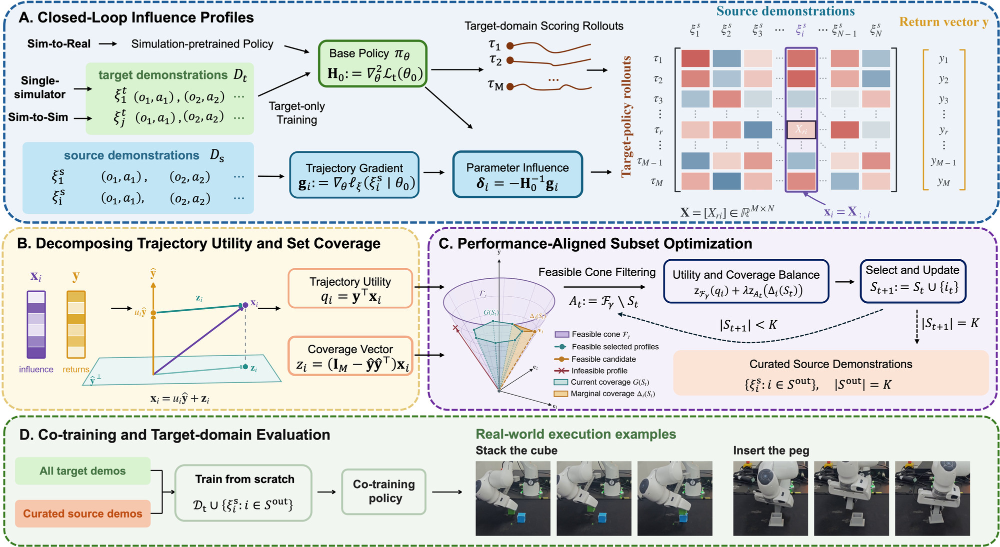

<div align="center">

<a href="https://tuco-curation.github.io/">
  
</a>

# TUCO: Curating Simulation Demonstrations for Sim-to-Real Robot Policy Co-Training

<p>
  Ning Zhu<sup>1,*</sup> &nbsp;·&nbsp;
  Mengfei Zhao<sup>2,3,*</sup> &nbsp;·&nbsp;
  Yikai Tang<sup>4,*</sup> &nbsp;·&nbsp;
  Zhangyujie Sun<sup>5</sup><br>
  Peihao Li<sup>6</sup> &nbsp;·&nbsp;
  Dongyue Ni<sup>7</sup> &nbsp;·&nbsp;
  Jindou Jia<sup>2,†</sup> &nbsp;·&nbsp;
  Jianfei Yang<sup>2,†</sup>
</p>

<p>
  <sup>1</sup>Stanford University &nbsp;·&nbsp;
  <sup>2</sup>Nanyang Technological University &nbsp;·&nbsp;
  <sup>3</sup>AXIS Robotics<br>
  <sup>4</sup>Carnegie Mellon University &nbsp;·&nbsp;
  <sup>5</sup>Fudan University &nbsp;·&nbsp;
  <sup>6</sup>University of California, Berkeley &nbsp;·&nbsp;
  <sup>7</sup>Shanghai Jiao Tong University
</p>

<sub><sup>*</sup>Equal contribution &nbsp;&nbsp; <sup>†</sup>Corresponding authors</sub>

<p>
  <a href="https://tuco-curation.github.io/">
    
  </a>
  <a href="https://arxiv.org/abs/2610.05407">
    
  </a>
</p>

<p><strong>Official implementation of TUCO.</strong></p>

</div>

## Abstract

Simulation demonstrations can supplement scarce real-world data for robot policy co-training.
However, the value of using data curation to actively select these demonstrations for sim-to-real co-training remains underexplored. Existing curation methods also lack a unified criterion for measuring trajectory-level utility and set-level coverage from closed-loop target behavior. To address these gaps, we present the first systematic study of data curation for sim-to-real robot policy co-training and propose **T**rajectory-level **U**tility and set-level **C**overage **O**ptimization (**TUCO**). TUCO uses influence functions to trace how each source demonstration affects target-domain scoring rollouts.
Our key insight is that these effects can be decomposed into an overall contribution to target return and variation across rollouts, providing a common closed-loop basis for measuring trajectory utility and set coverage. We further propose a performance-aligned subset optimizer that combines these measures in a unified curation objective to reduce redundancy and select complementary demonstrations. Extensive experiments on RoboMimic and OmniReset establish the value of active simulation data curation for sim-to-real policy co-training and show that TUCO achieves state-of-the-art performance across single-simulator, sim-to-sim, and sim-to-real settings.

<p align="center">
  <a href="https://tuco-curation.github.io/">
    
  </a>
</p>

<p align="center"><em>Overview of TUCO.</em></p>


---

## Environmental Setup

Use Ubuntu, Conda. Run commands from the repository root.

```bash
sudo apt-get install -y build-essential libosmesa6-dev libgl1-mesa-dev libglew-dev patchelf

# Single-simulator experiments
bash scripts/setup_environment.sh cupid

# Sim-to-sim and sim-to-real experiments
bash scripts/setup_environment.sh omnireset

# IsaacSim data collection (separate environment)
bash scripts/setup_isaacsim.sh
```

Environment specifications are provided in `environments/`. IsaacSim collection
requires a system meeting the [IsaacSim requirements](https://docs.isaacsim.omniverse.nvidia.com/5.1.0/installation/requirements.html).

## Data Preparation

### Single-simulator

Download the [RoboMimic datasets](https://diffusion-policy.cs.columbia.edu/data/training/robomimic_lowdim.zip) into `third_party/cupid/data/`:

```bash
conda activate cupid
bash scripts/generate_data.sh single-sim third_party/cupid/data
cp configs/launch/single_sim.env.example configs/launch/single_sim.env
```

Set the task, output paths, and filtering or selection budget in `single_sim.env`.

### Sim-to-sim

Place task assets and Franka experts under `artifacts/` and configure their
paths in `data_generation.env`. Supported tasks: `peg`, `stackcube`, `cupcake`.

```bash
conda activate omnireset_release
cp configs/launch/data_generation.env.example configs/launch/data_generation.env
cp configs/launch/sim2sim.env.example configs/launch/sim2sim.env
# Edit the configurations, then generate data.
bash scripts/generate_data.sh sim2sim configs/launch/data_generation.env peg
```

Output: `data/sim2sim/<task>/` (MuJoCo target, IsaacSim source).

### Sim-to-real

Use 10 user-collected real-robot rollouts for each task (Peg, StackCube, and
CupCake). Set `REAL_ROOT` in the data-generation configuration.

```bash
conda activate omnireset_release
bash scripts/generate_data.sh sim2real configs/launch/data_generation.env peg
bash scripts/generate_data.sh sim2real configs/launch/data_generation.env peg prepare-real
cp configs/launch/sim2real.env.example configs/launch/sim2real.env
```

Generated data are saved under `data/sim2real/<task>/`. Set the source-policy
checkpoint, simulation datasets, and real-rollout paths in `sim2real.env`.

> Matching Franka experts and reset/panel assets are not yet publicly released.
> CupCake vision data collection is not yet supported.

## Data Selection

```bash
# Single-simulator (cupid environment)
conda activate cupid
bash experiments/single_sim/run.sh configs/launch/single_sim.env select

# Sim-to-sim (omnireset_release environment)
conda activate omnireset_release
bash experiments/sim2sim/run.sh configs/launch/sim2sim.env select

# Sim-to-real (omnireset_release environment)
bash experiments/sim2real/run.sh configs/launch/sim2real.env select
```

## Training

```bash
# Single-simulator
conda activate cupid
bash experiments/single_sim/run.sh configs/launch/single_sim.env train

# Sim-to-sim
conda activate omnireset_release
bash experiments/sim2sim/run.sh configs/launch/sim2sim.env train

# Sim-to-real
bash experiments/sim2real/run.sh configs/launch/sim2real.env train
```

## Evaluation

```bash
# Single-simulator
conda activate cupid
bash experiments/single_sim/run_eval.sh configs/launch/single_sim.env

# Sim-to-sim
conda activate omnireset_release
bash experiments/sim2sim/run_eval.sh configs/launch/sim2sim.env
```
